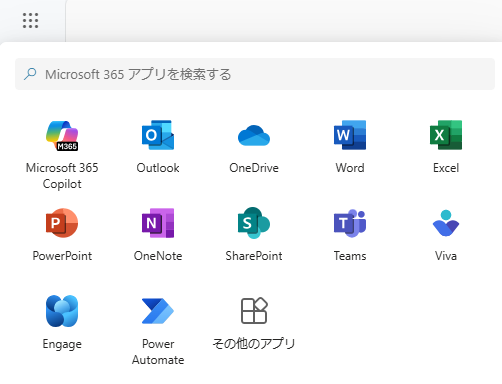
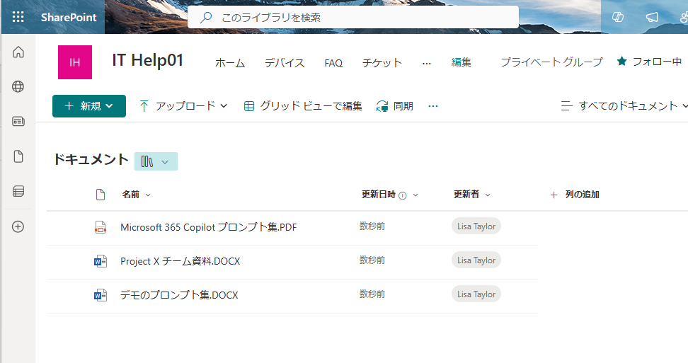
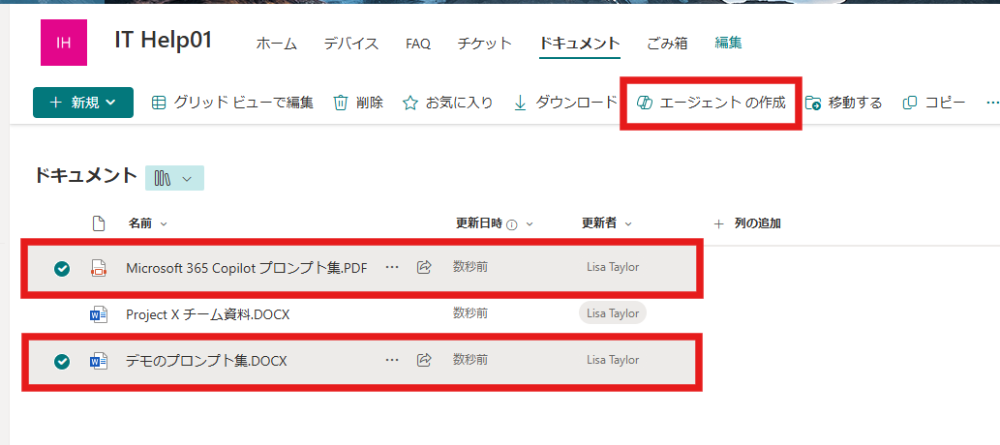
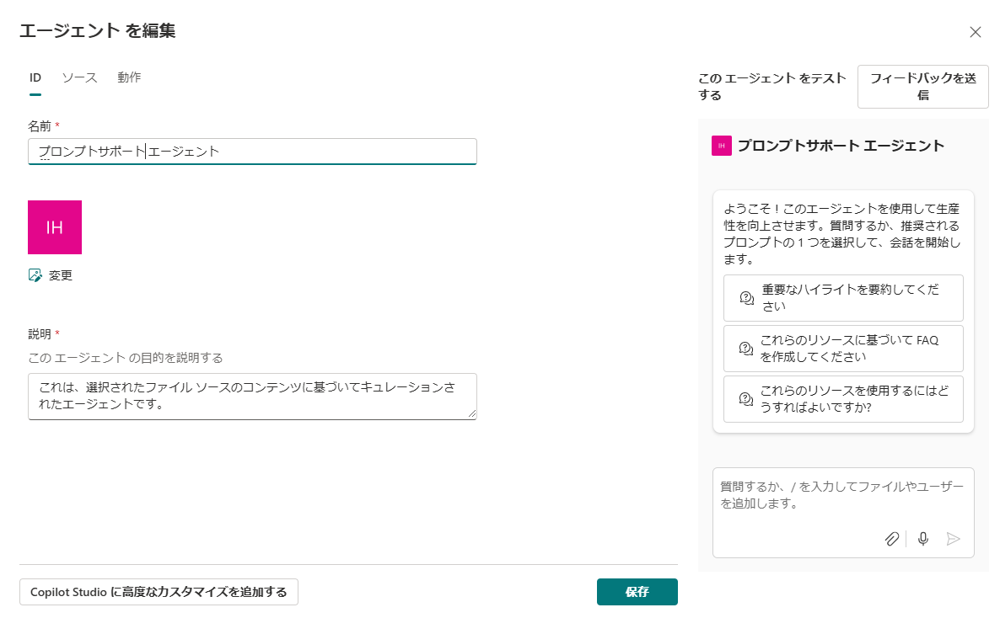
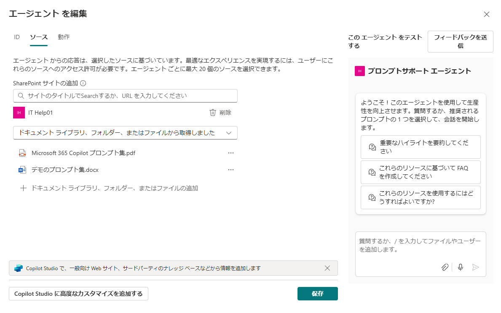
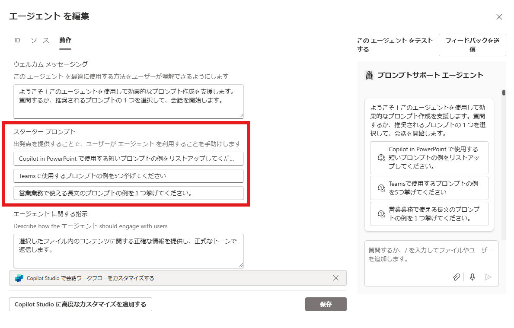
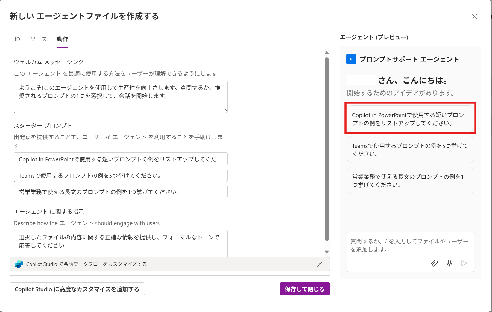
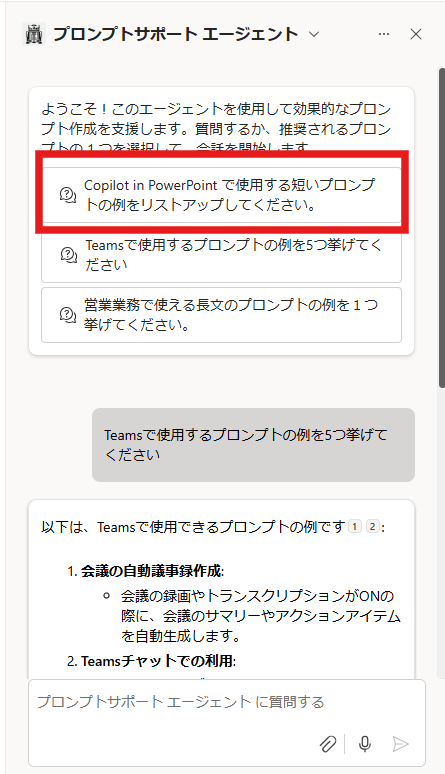

# Agents in SharePoint でエージェントを作成する
この演習では、特定のSharePointサイト内のドキュメントライブラリのドキュメントを使用して、Copilotプロンプトの例などの質問に答えることができる簡単なエージェントを作成します。

## 準備: SharePoint のサイトにアクセスする
まず、エージェントを作成するサイトにアクセスしましょう。

> [!NOTE]  
> 今回の演習で使うサンプルドキュメントは[こちら](./CopilotHandsonDocs/)からダウンロードできます。  
> 準備中や演習中にドキュメントの内容を確認しておいてください。

1. [ホーム | Microosft 365 Copilot](https://m365.cloud.microsoft/) に移動します。
2. ページの左上で [アプリ起動ツール] アイコンを選択し、[SharePoint] を選択して、SharePoint のスタートページに移動します。  

3. [IT Help01]というSharePointサイトを選択します。
> [!IMPORTANT]  
> 見つからない場合は、[https://csfcopilot.sharepoint.com/sites/ITHelp01](https://csfcopilot.sharepoint.com/sites/ITHelp01)に直接アクセスしてください。  
> もしくは、講師に連絡してください。
  
4. ナビゲーション メニュー(上部または左側)の[ドキュメント]をクリックしてドキュメントに移動します。今回利用するドキュメントファイルがアップロードされています。  



## エージェントを作成する
1.	ドキュメントライブラリを開いた状態で、”Microsoft 365 Copilot プロンプト集.PDF” と “デモのプロンプト集.DOCX” を選択して、タスクバーの[エージェントの作成]を押下します。  

2.	新しいエージェントの画面から、右下の[編集]を押下します。  

3.	エージェントを編集 の画面で、上部タブの[ID]、[ソース]、[動作]を順番に設定していきます。[ID]では任意の名前、説明を記述してください。ここでは“[アカウント名]エージェント”とします。  
例: ```AlexWエージェント```  

 
4.	[ソース]では、検索先のソースを設定します。先頬度選択したSharePointのドキュメント ライブラリの2つのドキュメントが設定されていることを確認します。ここではそのままにしておきます。  

 
5.	[動作]では、最初に表示されるメッセージと、スタータープロンプト、エージェントへの指示プロンプトを設定してください。 


 **[スタータープロンプト]**  
- ```Copilot in PowerPoint で使用する短いプロンプトの例をリストアップしてください。```  
- ```Teamsで使用するプロンプトの例を5つ挙げてください。```  
- ```営業業務で使える長文のプロンプトの例を１つ挙げてください。```  


6.	右側のエージェントのテスト画面で実際にプロンプトを入力しテストできます。まずはスタータープロンプトから一つを選択して、動作を確認してください。最後に下の[保存して閉じる]を押下し、×を押下してください。  
> [!NOTE]  
> ナレッジソース（ここでは2つのファイル）からの参照に時間がかかる場合があります。動作確認の前に[保存]から次のステップに行っても問題ありません。



## エージェントを使用する
1.	ITヘルプデスクのSharePointサイトを開き、右上のCopilotアイコンから、[ITヘルプデスク]と書かれている右側の∇でドロップダウンを開き、作成したエージェントを選択します。今回の例では [プロンプトサポートエージェント]を押下します。  

> [!NOTE]
> エージェントが表示されない場合は、少し待つか、ドキュメント内にある.Agentファイルをクリックして起動させてください。
 
2.	ここでは、３つあるスタータープロンプトから一つを選択してプロンプトを入力してみてください。  


# 次のステップ
[Agents Builder でエージェントを作成する](2-agents-builder.md)
