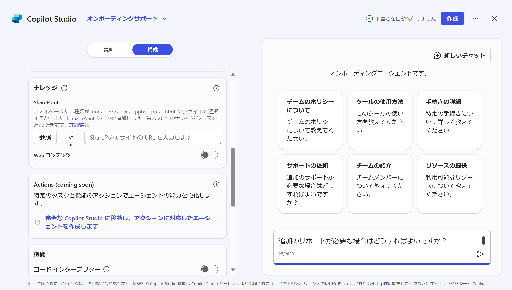

# Agents Builder でエージェントを作成する
この演習では、Microsoft 365 Copilot Chat内から Agents Builder を使い、簡単なエージェントを作成します。

> [!NOTE]  
> ここでは、Agent in SharePointの最初にダウンロードした内の「Project X チーム資料.DOCX」を使用します。  

## エージェントを作成する
1.	[Copilot | Microsoft 365](https://m365.cloud.microsoft/chat/) を開き、右ペインから[エージェントの作成]を押下します。  

 
2.	Copilot Studioが開いたら、次のプロンプトを入力してください。  
```
新しいチームメンバーがチームに参加する際に、質問に答えるためのオンボーディングエージェントが必要です。
```

 
3.	以降、自然文でのやり取りを行ってください。まずエージェント名を提案されますので、そのままでよければ、“はい”というような文章を入力してください。

 
4.	トーンなどの質問には、例えば以下のように入れてみてください。  
```
新入社員なので、やさしく、親しみやすい口調で答えてください。
```  
その後、左側上部のトグルを[説明]から[構成]にしてください。

 
5.	構成画面では、先ほどの自然文でのやり取りが設定として入力されていることを確認して下さい。  
エージェントのアイコンを設定するために、[詳細]セクションの一番上のアイコンの右側にある鉛筆マークを押下します。  

 
6.	アイコンの変更から、ローカルにあるPNG形式で1MB未満の適当な画像を選択してください。（適当な画像がない場合は変更いただかなくても問題ありません）  

 
7.	このエージェントの回答のソースとなるナレッジを設定します。
[ナレッジ]セクションの[参照]からSharePoint ファイル ピッカーを開き、最初の準備でダウンロードして、SharePointサイトに保存した、“Project X チーム資料.docx”を選択します。
  

 
 
8.	スタータープロンプトを確認して、必要に応じて変更、削除します。  
例えばここでは、“手続きの詳細”というタイトルのスタータープロンプトを変更してみます。  
> [!NOTE]  
> 都度スタータープロンプトとして設定されるものが違うことがあるので、どれを変更いただいてもかまいません。あるいは[スタータープロンプトを追加する]から追加いただいてもかまいません。

タイトル：```SharePointの使用方法```  
メッセージ：```SharePointの使用方法について教えてください```  

 
9.	では、右側のテスト画面でテストしてみましょう。  
スタータープロンプトから“SharePointの使用方法”を押してプロンプトを入力してみてください。  
動作を確認出来たら、右上の[作成]を押下してください。  

 
10.	エージェントが作成されると、次の画面が表示されますので、[エージェントに移動する]を押下してください。  

  
11.	M365 Copilot Chat の画面に遷移し、オンボーディングサポートが表示されていることを確認してください。  

 
> [!NOTE]  
> 右ペインのエージェントの一覧から“オンボーディングサポート”を選択して開くこともできます。表示されない場合はブラウザをリフレッシュしてみてください。  

12.	まずはテストで、適当なスタータープロンプトからプロンプトを入力し、動作を確認してください。


## エージェントを編集する
1.	M365 Copilot Chat画面の右ペインから[エージェントの作成]を押下します。  
2.	“Copilot Studio”の記述の右側のドロップダウンから、先ほど作成したエージェントを選択します。ここでは“オンボーディングサポート”になります。

 
上記操作で対象のエージェントが表示されない場合は、一度[エージェントをすべて表示する]から一覧を表示して、対象となるエージェントの編集ボタン（鉛筆ボタン）を押下してください。  
  

 
3.	エージェント作成時の画面が開きます。ここで、構成を変更することができます。
例えば、ここでは[指示]の中の全て削除し、次のように置き変えてみます。
```
- 絵文字を使用して答える。
- 関西弁で、親しみやすい口調で答える。
```  

右上の[更新]を押下します。  

4.	M365 Copilot Chatの画面に戻ってテストをしてください。少しタイムラグがある場合があるので、想定通りに回答が返されない場合には、少し時間をおいてお試しください。


## 挑戦: エージェントを編集する（任意）
ナレッジの[Web コンテンツ]をオンにして動きの違いを確認してみましょう。  
  

機能の[画像ジェネレータ]をオンにして動きを確認してみましょう。

プロンプト例  
```
新入社員が入社してきて、オフィスで生き生きと働いている姿の画像を作成してください
```  

# 以上でハンズオンは終了です
お疲れさまでした！  
